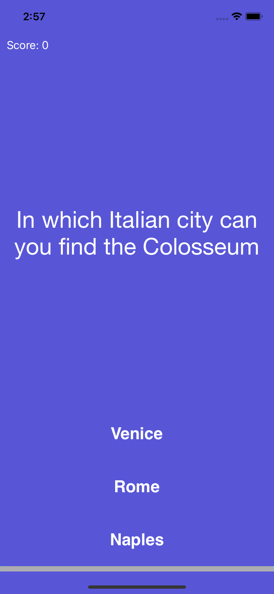
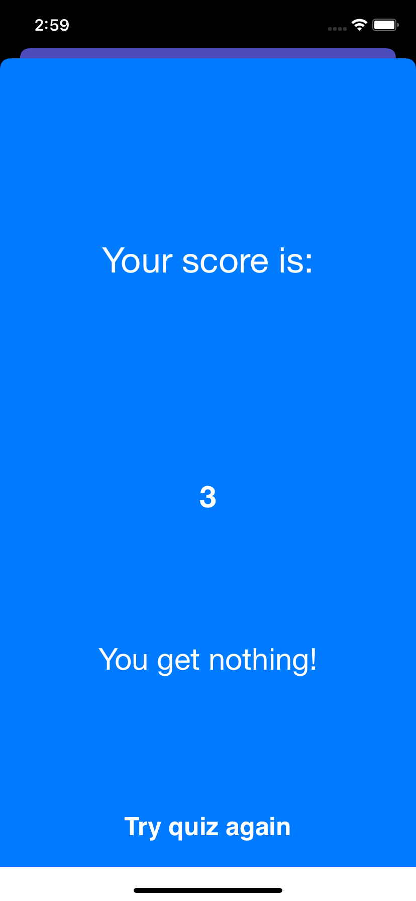

[](https://swift.org/)
[](http://cocoapods.org/pods/LFAlertController)

# Custom Quiz App

A simple quiz app built with Swift using the [Model View Controller(MVC)](https://developer.apple.com/library/archive/documentation/General/Conceptual/DevPedia-CocoaCore/MVC.html) design pattern

<p align="row">


</p>

# Requirements

- iOS 8.0+ 
- Xcode 9.3

## How to run

1) Clone this project 
```sh
git clone https://github.com/benjiTKJ/custom-quiz-app.git
```

2) Open Xcode and click 'open a project or file'

3) Select folder [Custom Quiz App.xcodeproj](./Custom%20Quiz%20App/Custom%20Quiz%20App.xcodeproj/)

4) Click on run (top left hand corner)